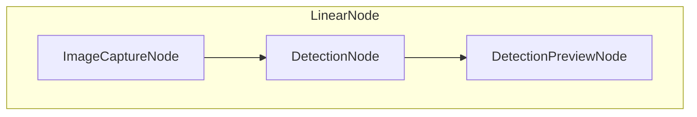
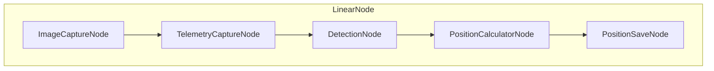

# LMAO Graph System

One of the most significant features of LMAO is the LMAO Graph. It allows you to create detection systems by combining several predefined pieces. This architecture allows you to look at the system from a more high-level perspective, making it easier to compherend. It was inspired by a 2001 paper https://www.researchgate.net/publication/221410202_A_Modular_Software_Architecture_for_Real-Time_Video_Processing.

### Important conepts
- **Signal** - Signal is a data that passes between nodes. Each node, processes it and then passes it to the next node. In this implementation signal is simply a python dictionary.
- **Node** - Node is an element of the LMAO Graph. Each node should be as independent from others as possible. Most nodes modify the incoming signal, but they do not have to do this. Nodes can have their own state and can communicate with other services in order to achieve their desired functionality. A node can be just a signal processing node (eg. `ImageCaptureNode`) or can combine several other nodes to pass the signal between them in a certain manner (ex. `LinearNode`). 
- **Node Runner** - Node Runner is used to run the LMAO Graph. It takes only a single node and applies all of its operations on it. When running, it generates singals in a loop and passes them to the specified node, which processes them further.

### Node API
Each node can implement 3 functions: `setup()`, `process(signal)` and `tear_down()`.
- **[optional]** `setup()` - This function is meant to set up anything a node might need to run. It is executed by a runner before generating any signals and processing them.
- **[required]** `process(signal)` - This is the main function of any LMAO Graph Node. The passed signal can be modified or its data can be used in some other way depending on the Node in question.
- **[optional]** `tear_down()` - This function's puprose is to cleanup any data or system objects that were inititalized for a node to run. It is executed by a runner when trying to stop the graph after all processing has finished.

## Examples
Here are some hypothetical systems that could be created with this architecture. Note that these are just high level, hypothetical LMAO Graphs and the actual implementations might differ slightly both in naming and in structure. However, this does not stop them from showcasing this approach's potential.

#### Simple detector

Let's create a LMAO Graph that captures an image, detects objects on it and shows user the result. 

##### Graph


##### Python Pseudocode
```python
graph = LinearNode([
    ImageCaptureNode(output_image_key='image'),
    DetectionNode(
        input_image_key='image',
        output_detections_key='detections',
    ),
    DetectionPreviewNode(
        input_image_key='image',
        input_detections_key='detections',
    ),
])
```

##### Data Flow
Let's examine how such system would process a signal.
1. Signal is created. At first it does not hold any significant data so we can assume it's an empty dicitonary `{}`.
1. It is passed into the `LinearNode`, so it is processed by each child node one-by-one.
	1. `ImageCaptureNode`. This node captures a single frame from the camera and stores it in the signal under the key equal to `output_image_key`. In this case that is "image". After this node, the signal looks as follows
		```python
		{
		    "image": <PRETEND THIS IS DATA FOR AN IMAGE>
		}
		```
	1. `DetectionNode`. This node takes an image (`input_image_key`), and outputs objects detected on it to `output_detections_key`.
		```python
		{
		    "image": <PRETEND THIS IS DATA FOR AN IMAGE>,
		    "detections": [<DETECTION 1>, <DETECTION 2>, ..., <DETECTION N>]
		}
		```
	1. `DetectionPreviewNode`. This node takes an image (`input_image_key`) and (`input_detections_key`). It shows to the user the detections marked on the input image.

#### Simple Object Position Calculator

Pretend we're making another detector for some drone competition. A very common objective in such competitions is to make a program that can calculate ground position of some objects. Let's try using LMAO for this.

##### Graph


##### Python Pseudocode
```python
graph = LinearNode([
    ImageCaptureNode(output_image_key='image'),
    TelemetryCaptureNode(output_telemetry_key='telemetry'),
    DetectionNode(
        input_image_key='image',
        output_detections_key='detections',
    ),
    PositionCalculatorNode(
        input_detections_key='detections',	
        input_telemetry_key='telemetry',
        output_positions_key='positions',
    ),
    PositionSaveNode(
        file_name='calculated_positions.csv',
        input_positions_key='positions',
    )
])
```

##### Data Flow
Let's examine how such system would process a signal.
1. Signal is created. At first it does not hold any significant data so we can assume it's an empty dicitonary `{}`.
1. It is passed into the `LinearNode`, so it is processed by each child node one-by-one.
	1. `ImageCaptureNode`. This node captures a single frame from the camera and stores it in the signal under the key equal to `output_image_key`. In this case that is "image". After this node, the signal looks as follows
		```python
		{
		    "image": <PRETEND THIS IS DATA FOR AN IMAGE>
		}
		```
	1. `TelemetryCaptureNode`. This node captures current telemetry and stores it in the signal based on the key `output_telemetry_key`.
		```python
		{
		    "image": <PRETEND THIS IS DATA FOR AN IMAGE>,
		    "telemetry: Telemetry(
		        position=<DRONE POSITION>,
		        rotation=<DRONE ROTATION>
		    )
		}
		```
	1. `DetectionNode`. This node takes an image (`input_image_key`), and outputs objects detected on it to `output_detections_key`.
		```python
		{
		    "image": <PRETEND THIS IS DATA FOR AN IMAGE>,
		    "telemetry: Telemetry(
		        position=<DRONE POSITION>,
		        rotation=<DRONE ROTATION>
		    ),
		    "detections": [<DETECTION 1>, <DETECTION 2>, ..., <DETECTION N>],
		}
		```
	1. `PositionCalculatorNode`. This node takes the telemetry (`input_telemetry_key`), and detected objects (`input_detections_key`) and based on their screen position it calculates each object's position (`output_positions_key`).
		```python
		{
		    "image": <PRETEND THIS IS DATA FOR AN IMAGE>,
		    "telemetry: Telemetry(
		        position=<DRONE POSITION>,
		        rotation=<DRONE ROTATION>
		    ),
		    "detections": [<DETECTION 1>, <DETECTION 2>, ..., <DETECTION N>],
		    "positions": [<POSITION 1>, <POSITION 2>, ..., <POSITION N>]
		}
		```
	1. `PositionSaveNode`. This node saves the calculated object positions (`input_positions_key`) into the file `calculated_positions.csv`.
